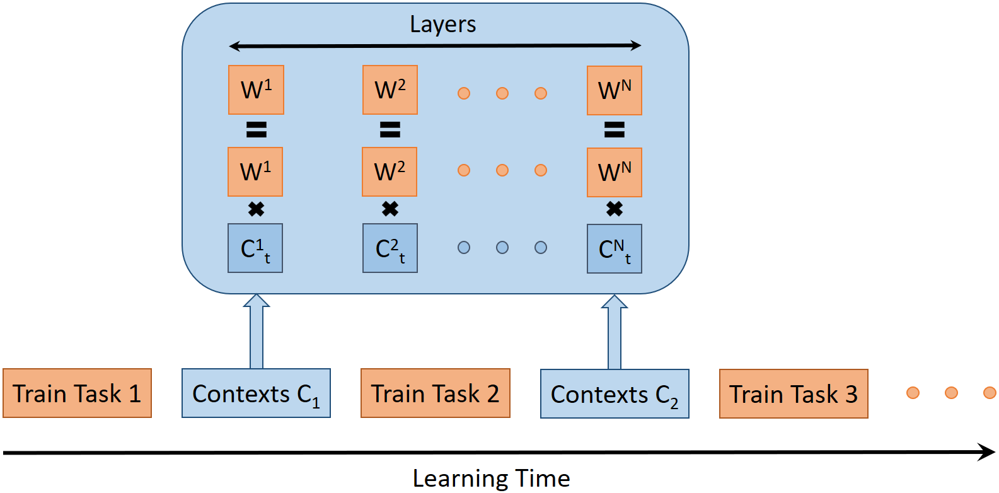
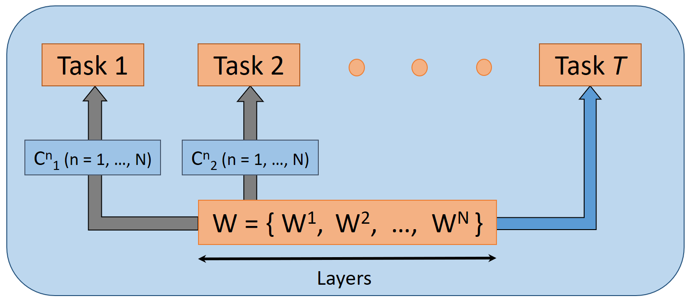

# *SuperFormer*: Continual learning superposition method for text classification

## Overview

This repository contains implementation code for a novel continual learning method, called *SuperFormer*.
*SuperFormer* method alleviates model forgetting, while spending negligible additional memory and time. 
We compare the method against several prominent continual learning methods, i.e., EWC, SI, MAS, GEM, PSP, etc. on a set of
text classification tasks and achieve favorable results in terms of performance, memory, and speed.

## Key idea of SuperFormer

The main idea of this method is to train different tasks consecutively in a single network using the stochastic gradient descent algorithm.
In between the tasks we use *contexts*, which serve as a model forgetting mitigation mechanism, 
since they allow for training tasks in nearly orthogonal subspaces. 

<!-- ![SuperFormer learning] -->
<!-- (images/SF_learning.png "SuperFormer learning") -->
<p align="center">
    
</p>

*Contexts* are utilized to switch between different tasks 
and at the inference time they serve to obtain the suitable network weights for a specific task.

<!-- ![SuperFormer inference] -->
<!-- (images/SF_inference.png "SuperFormer inference") -->
<p align="center">
    
</p>


## Requirements

All methods have been tested using Python 3.9 and PyTorch 1.9.

To have consistent libraries and their versions, you can install needed dependencies 
for this repository running the following command (from the root project directory):

```
pip install -r requirements.txt
```


## Running the code

We provide ready-to-run code for our *SuperFormer* model and the following methods of comparison: 
Upper bound, Lower bound, EWC, Online EWC, SI, MAS, GEM, PSP, and Adapters. 
EWC, Online EWC, SI, MAS, GEM methods are adapted from:
Hsu, Y.C., Liu, Y.C., Ramasamy, A., Kira, Z., 2018. Re-evaluating continual
learning scenarios: A categorization and case for strong baselines, in:
NeurIPS Continual learning Workshop.
Starting from the root directory, you can run models as follows:

- *SuperFormer*
```
python main.py --method SuperFormer
```

- Upper bound (each task trained in a separate network)
```
python separate_networks_and_adapters.py --method Upper_bound
```

- Lower bound (all tasks trained in a single network without any model forgetting mitigation mechanism)
```
python separate_networks_and_adapters.py --method Lower_bound
```

- EWC
```
cd benchmarks
python main_benchmarks.py --method EWC
```

- Online EWC
```
cd benchmarks
python main_benchmarks.py --method Online_EWC
```

- SI
```
cd benchmarks
python main_benchmarks.py --method SI
```

- MAS
```
cd benchmarks
python main_benchmarks.py --method MAS
```

- GEM Large (50 additional stored old examples per task)
```
cd benchmarks
python main_benchmarks.py --method GEM_Large
```

- GEM Small (5 additional stored old examples per task)
```
cd benchmarks
python main_benchmarks.py --method GEM_Small
```

- PSP
```
python main.py --method PSP
```

- Adapters
```
python separate_networks_and_adapters.py --method Adapters
```


## Miscellaneous

Please send any questions you might have about the code or the algorithm to <marko.zeman@fri.uni-lj.si>.

## License

*SuperFormer is* is licensed under the MIT License.
